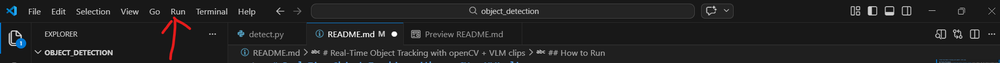

# Real-Time Object Tracking with openCV + VLM clips

## Project description
This project implements a **real-time object tracking system** using a webcam. The user selects an object in the first frame, and the system tracks it continuously in real time.


bonus

this project also has an **extra feature that is using a Vision-Language Model taht is (CLIP)** to classify the selected object. This helps improve the system by giving semantic understanding of what is being tracked.

---

## Features
- Select any object using a bounding box
- Real-time tracking using OpenCV (CSRT Tracker)
- Object classification using CLIP (VLM)
- Live FPS display

---

## Technologies Used
- Python
- OpenCV
- PyTorch
- CLIP (Vision-Language Model)
- PIL (Python Imaging Library)

---

## Project Structure
```
project/
   detect.py
   image-1.png
   README.md


```

---

## Installation

### 1. Clone Repository
```bash
git clone https://github.com/Meranalhudaithy/object_detection.git
cd object-detection
```

### 2. Install Dependencies
```bash
pip install opencv-contrib-python torch torchvision pillow git+https://github.com/openai/CLIP.git
```

---

## How to Run
```bash
python detect.py
```

or just press the run button on the top left


---


**the first time you run the code it will take time till the camera sets up because it is running and dowloading the dependancies for the first time ever**

---
## How to Use

1. Run the code  
2. Put the object you want to track in camra view  (you will have to wait for a while because it takes time to lode the photo frame no longer then 15 seconds tho)
3. Draw a bounding box around the object  
4. Press Enter again  

code will then
- Start real time tracking of object  
- Display the object labels 
- Show tracking status and FPS  

### Controls
- Press **G** to Exit program (ps i made it g isntead of q because eyego)

---


### CLIP  (Extra reqirment added to boost the code)
i added an extra feature which is using a **Vision-Language Model (CLIP)**:


The tracked object is processed and encoded  from the img then compared against text labels that where given after that the most similar label is selected  

This elevates the code by adding semantic understanding not just tracking an object.

---


## Author
Meran Alhudaithy